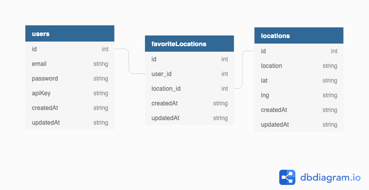

# Introduction

Express Sweater Weather is a one-week solo project built for Mod 4 of Turing's Back End software program. It is a port of a previous Ruby on Rails project into JavaScript using Node.js, Express, Sequelize, and PostgreSQL.

Sweater Weather is an API that retrieves geocoding information from Google's GeoCoder API, weather forecast information from Dark Sky API, and processing the data before serving a response back to the user.

Users can register or login to receive their current API key, request a forecast for a location, favorite a location, receive current forecasts for all their favorite locations, and delete a favorite location.

# Setup

Update postgres username in /config/config.json

Create a .env file at the root level

Create an API key with Google Geocoder. Add it to .env as GEO_KEY=my_api_key

Create an API key with Dark Sky. Add it to .env as DARK_SKY=my_api_key

$ npx sequelize db:create

$ npx sequelize db:migrate

# How to Use

## Account Creation

```
Example Request

POST /api/v1/users
Content-Type: application/json
Accept: application/json

{
  "email": "my_email@example.com",
  "password": "password"
  "password_confirmation": "password"
}

Example Response

status: 201
body:

{
  "api_key": "jgn983hy48thw9begh98h4539h4",
}
```

## User Login

```
Example Request

POST /api/v1/sessions
Content-Type: application/json
Accept: application/json

{
  "email": "my_email@example.com",
  "password": "password"
}

Example Response

status: 200
body:

{
  "api_key": "jgn983hy48thw9begh98h4539h4",
}
```

## City Forecast

```
Example Request

GET /api/v1/forecast?location=denver,co
Content-Type: application/json
Accept: application/json

body:
{
  "api_key": "jgn983hy48thw9begh98h4539h4"
}

Example Response

{
  "location": "Denver, C0",
  "currently": {...},
  "hourly": {...},
  "daily": {...}
}
```

## Favorite a Location

```
Example Request

POST /api/v1/favorites
Content-Type: application/json
Accept: application/json

body:

{
  "location": "Denver, CO",
  "api_key": "jgn983hy48thw9begh98h4539h4"
}

Example Response

status: 200
body:

{
  "message": "Denver, CO has been added to your favorites",
}
```

## Forecasts for All Favorite Locations

```
Example Request

GET /api/v1/favorites
Content-Type: application/json
Accept: application/json

body:

{
  "api_key": "jgn983hy48thw9begh98h4539h4"
}

Example Response

status: 200
body:
[
  {
    "location": "Denver, CO",
    "current_weather": {}
  {
    "location", "Topkea, KS",
    current_weather": {...}
  }
]
```

## Deleting a Favorite Location

```
Example Request

DELETE /api/v1/favorites
Content-Type: application/json
Accept: application/json

body:

{
  "location": "Denver, CO",
  "api_key": "jgn983hy48thw9begh98h4539h4"
}

Example Response

status: 204
```

# Known Issues

Mocks are not yet implemented, so API calls should be used conservatively.

Forecasts and favorites need to be refactored.

API calls should be refactored into services.

# Running Tests

$ npm test

# How to Contribute

Email me if you would like to contribute!

# Core Contributors

Jacob Miller

jake0miller@gmail.com

# Schema Design



# Deployed Location

https://intense-hamlet-80398.herokuapp.com/

# Tech stack

Express 4.16.1

Sequelize 5.5.1

NPM 6.9.0

Node.js 10.16.3
